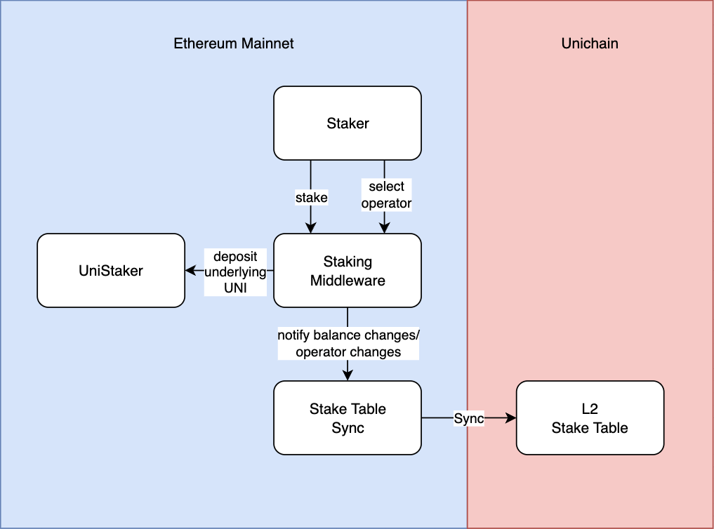
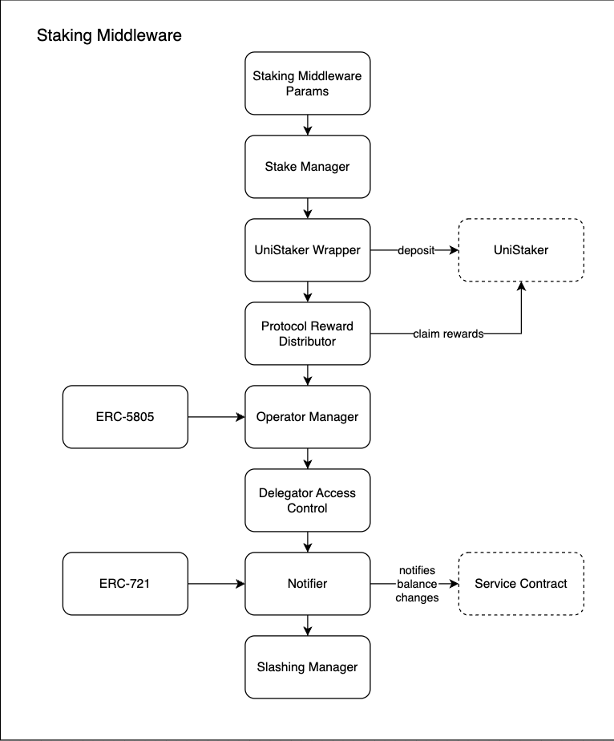

# UVN L1 components

This document describes the components of the Unichain Validator Network (UVN) deployed on the L1 (Ethereum Mainnet).

Stakers deposit their stake into the Staking Middleware contract to delegate it to UVN operators. Optionally they can also deposit their underlying stake into the UniStaker contract to participate in UNI governance and earn protocol fees. The staking middleware contract also introduces a notification mechanism to allow syncing of the operator and delegator balances to L2. The notification recipient can be selected by operators to allow for upgrades to the system without the need for unstaking or downtimes.

## Staking Middleware

The staking middleware contract manages the staking of UNI, the selection of operators, the notification mechanism, the deposit of UNI into the UniStaker contract, slashing and more. The contract is split into 8 base contracts each focusing on a specific aspect of the staking system for better clarity of the functionality. Functions have hooks such as `_beforeAction` and `_afterAction` that can be called internally to allow other base contracts to add custom logic when actions are performed. The following section goes into more detail about the functionality of each base contract.

### Staking Middleware Params

The staking middleware contract has a number of parameters that can be set that apply to the entire staking system. These parameters include the withdrawal delay and the slashing beneficiary.

- `withdrawalDelay`: The delay in seconds before a staker can withdraw their stake or undelegate from an operator.
- `slashingBeneficiary`: The address of the beneficiary that receives the slashed amount.

### Stake Manager

This contract is responsible for managing deposits and withdrawals of UNI into the staking middleware. Whenever a staker unstakes an amount of UNI, the amount is added to a withdrawal queue and can be withdrawn after the withdrawal delay. The stake pending for withdrawal is slashable until the withdrawal is completed, so a staker can be slashed even if the withdrawal delay has passed as long as the withdrawal is not completed.

The stake manager also handles the slashing of delegator stake. Whenever an operator is slashed, the delegators stake is slashed by the same percentage. The delegated stake and the pending withdrawal amount are both slashed by the same percentage.

This function exposes before and after hooks that can be extended by subsequent base contracts with custom logic for the following functions:

- stake
- unstake
- withdraw
- slash

### UniStaker Wrapper

This contract allows delegators to deposit their entire stake into the UniStaker contract to participate in UNI governance and earn protocol fees. When opting into the UniStaker contract, the delegator must provide a governance delegate that should represent their interests in the governance of UNI. Once opted into the UniStaker contract, all subsequent deposits will also be deposited into the UniStaker contract. Should a delegator withdraw their entire stake, either by opting out of the UniStaker contract or by withdrawing their entire stake from the staking middleware, subsequent deposits are no longer deposited into the UniStaker contract automatically and require a new opt-in.

This base contract utilizes the following hooks from the `StakeManager` contract:

- `_afterStake`: After a delegator stakes, if they are opted into the UniStaker contract, deposit their stake into the UniStaker contract
- `_beforeWithdraw`: Before a delegator withdraws, if they are opted into the UniStaker contract, withdraw their stake from the UniStaker contract

This contract exposes the following hooks for other contracts to extend:

- `_beforeUniStakerDeposit`: Before a delegator opts into the UniStaker contract
- `_beforeUniStakerWithdrawal`: Before a delegator opts out of the UniStaker contract
- `_beforeUniStakerDelegateChange`: Before a delegator changes their governance delegate

### Protocol Reward Distributor

This contract distributes protocol fees accrued by stake deposited into UniStaker to delegators that have opted into the UniStaker contract.

Because deposits into the UniStaker are optional and every delegator has their own unique deposit, on slashing the operator votes are slashed but the actual slashing of delegator stake is finalized whenever they next interact with the staking middleware. This could incentivize slashed delegators to refrain from interacting with the staking middleware contract to continue accruing protocol fees for the full unslashed amount. Therefore, in order to be able to slash rewards accrued as well, the staking middleware is set as the beneficiary for the protocol rewards within the UniStaker contract.

The contract then uses a discrete reward distribution mechanism to distribute the rewards to delegators proportional to their stake deposited into the UniStaker contract.

The contract utilizes the following hooks from other base contracts

- `_beforeStake`
- `_beforeWithdraw`
- `_beforeUniStakerDeposit`
- `_beforeUniStakerWithdrawal`

to ensure that the rewards are fully awarded with the previous stake whenever the balance deposited into the UniStaker contract is changed. When the slashing of the operator is finalized, the rewards are updated automatically adjusted for the slashed balances, therefore the slash hook is not needed.

This contract exposes the following hooks:

- `_beforeRewardsWithdrawal`: Before a delegator withdraws their rewards

### Operator Manager

This contract manages the delegation and undelegation of stake from delegators to operators. This contract implements the `ERC-5805` interface. Before a delegator can undelegate from an operator, they must pass the withdrawal delay period. During this delay period their voting power is set to 0 but they remain slashable until the undelegation is finalized, even should the withdrawal delay pass.

This contract also implements the slashing of operator votes. Whenever an operator is slashed, the slashable stake and the voting power of the operator are both slashed by the same percentage immediately.

The contract utilizes the following hooks from other base contracts:

- `_afterStake`: After a delegator stakes, increase the operator's voting power and increase the slashable stake
- `_afterUnstake`: After a delegator unstakes their stake, decrease the operator's voting power
- `_afterWithdraw`: After a delegator withdraws their unstaked stake, decrease the slashable stake of the operator

This contract exposes before and after hooks for the following functions:

- operator delegation
- operator undelegation announcement
- operator undelegation

### Delegator Access Control

This contract allows operators to define rules defining which delegators are allowed to delegate to them. They can either accept or deny all delegations. If they choose to allow delegations, they can set additional rules. An operator can set a contract that implements the `IDelegatorVerifier` interface to verify whether a delegator is allowed to delegate to them. Because the `delegate` function specified by ERC-5805 does not allow for arbitrary data to be passed during delegation, the operator can also provide an `authorizedSender` address. If a delegator is delegating via signature, the `authorizedSender` address can be set to ensure that the signature is provided by a contract that can perform arbitrary checks (e.g., verify a merkle proof to ensure a delegator is allowed). Should an operator set an authorized sender and the delegator does not delegate via a signature, the verifier contract is used to verify whether the delegator is allowed to delegate to the operator. If the authorized sender is set but there is no verifier contract set, the delegation is rejected and only delegation via signature is allowed.

This contract utilizes the following hook from the `OperatorManager` contract:

- `_beforeOperatorSelection`: Before a delegator delegates to an operator, verify whether the delegator is allowed to delegate to the operator

### Slashing Manager

This contract is responsible for slashing operators. The operator can either be slashed by a percentage of their slashable stake or by an amount, the amount is then converted to a percentage of the slashable stake.

Because every delegator has their own unique deposit, on slashing the operator, the voting power of the operator is slashed immediately, however the underlying stake is only slashed when the delegator next interacts with the staking middleware (there is a function to also force a delegator slashing that can be called by anyone).

To ensure that the delegator does not continue accruing rewards for the slashed amount, the rewards are also slashed by the same percentage.

The contract utilizes the following hooks to track slashing instances:

- `_afterOperatorSelection`: After a delegator delegates to an operator, track the number of slashing instances the operator had before the delegation
- `_afterOperatorDeselection`: After a delegator undelegates from an operator, reset the slashing tracking data for the delegator

This contract utilizes the following hooks to ensure any pending slashing instances are applied to the delegator's stake:

- `_beforeStake`: Before a delegator stakes, apply any pending slashing instances to the delegator's stake
- `_beforeUnstake`: Before a delegator unstakes, apply any pending slashing instances to the delegator's stake
- `_beforeWithdraw`: Before a delegator withdraws, apply any pending slashing instances to the delegator's stake
- `_beforeUniStakerDeposit`: Before a delegator deposits into the UniStaker contract, apply any pending slashing instances to the delegator's stake
- `_beforeUniStakerWithdrawal`: Before a delegator withdraws from the UniStaker contract, apply any pending slashing instances to the delegator's stake
- `_beforeUniStakerDelegateChange`: Before a delegator changes their governance delegate, apply any pending slashing instances to the delegator's stake
- `_beforeRewardsWithdrawal`: Before a delegator withdraws their rewards, apply any pending slashing instances to the delegator's stake
- `_beforeOperatorUndelegationAnnouncement`: Before a delegator announces their intention to undelegate from an operator, apply any pending slashing instances to the delegator's stake
- `_beforeOperatorDeselection`: Before a delegator undelegates from an operator, apply any pending slashing instances to the delegator's stake
