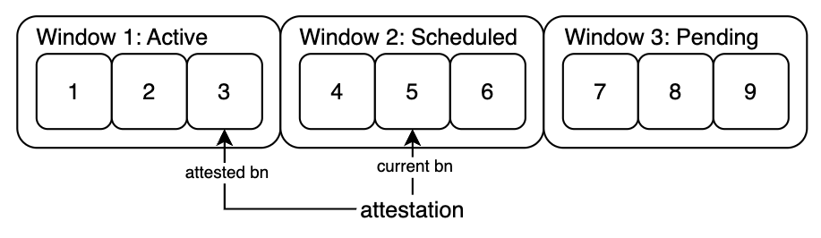
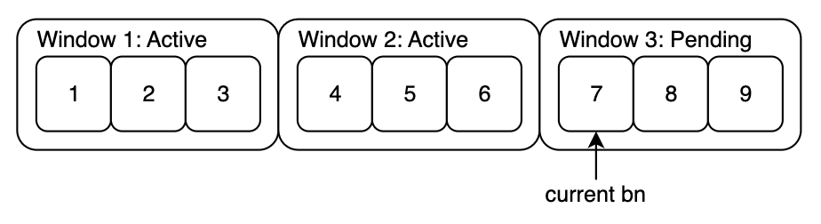
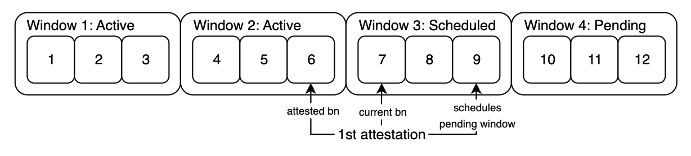
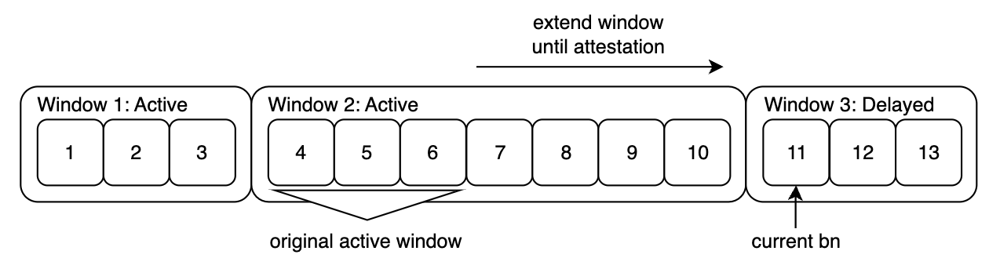
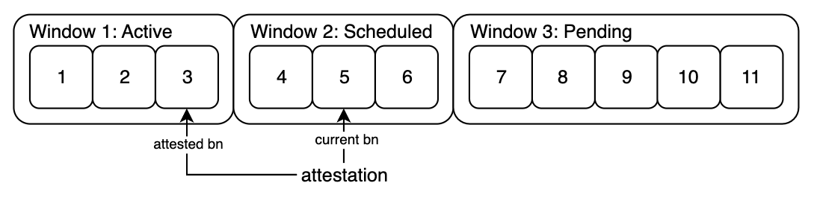

# UVN L2 components

This document describes the components of the Unichain Validator Network (UVN) deployed on the L2 (Unichain).

## Reward Distributor

The Reward Distributor contract is responsible for receiving attestations from operators and distributing rewards based on their participation.

### Attestations

Figure 1: Attestation Window

Operators attest to windows of blocks, whereby the actual attestation is made to the block hash of the last block in the window, as it contains the block hashes of the previous blocks in the window. The length of the window can be configured, in order to attest to every single block, the attestation window length can be set to 1.

To ensure a predictable block number to attest to, the Reward Distributor contract will schedule the next window the configured amount of blocks after the last active attestation window. While the window is scheduled, the Reward Distributor will accumulate rewards and reserve them for the scheduled window.

Figure 2: Pending Attestation Window

The attestation window after the scheduled window is marked as pending. As soon as the current block number is greater than the scheduled window, it becomes active.
The window after the scheduled (now activated) window is initially marked as pending.

Figure 3: Scheduling of Next Window

On the first attestation after the scheduled window has become active (Window 2 in this example), the rewards that accumulated during this window are pulled from the rewards source. The pending window is then marked as scheduled and starts accumulating rewards.

Figure 4: Delayed Window

To recover from liveness failures, to ensure proper scheduling of windows and accurate reward distribution, should no attestations be submitted for the last active window during the pending window, the active window will expand to include the pending window. It will keep expanding until an attestation is submitted for the latest block. As soon as an attestation is submitted, the delayed window after the active window will be marked as scheduled again and operations will resume as normal (See Figure 1).

### Parameters

#### Attestation Window Length

The size of the windows can be adjusted at any time, to ensure a smooth transition, the scheduled window will remain scheduled for the same block, the pending window will be adjusted to the new size.

Figure 5: Adjustment of window length from 3 to 5 blocks, see Figure 1

#### Attestation Period

The attestation period marks the number of blocks operators have to attest to an active window before it becomes finalized. To ensure that there is always an active window to attest to, the attestation period must be at least the attestation window length.
